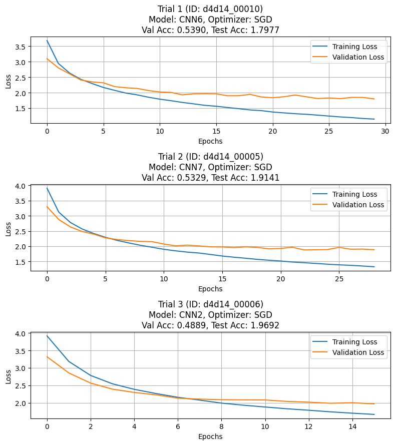
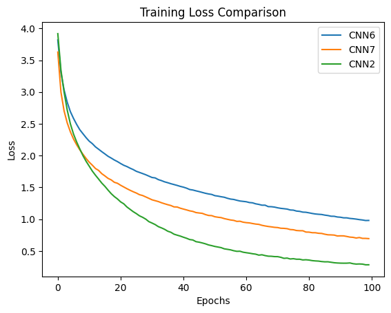

# Introduction 

This report details the development and evaluation of three
Convolutional Neural Network (CNN) models trained purely on the
CIFAR-100 dataset. It covers the experimental setup (in
[Section 2](#experimental-setup)), multiple model evaluations (in
[Section 3](#models-evaluation)), the model selection (in
[Section 4](#best-model-architectures)), the full retraining process
(in [Section 5](#full-retrain)), and a comparison with top models in
[papers with code](https://paperswithcode.com/sota/image-classification-on-cifar-100).

# Experimental Setup 

## Data Splitting

The CIFAR-100 dataset is made up of 50,000 training images and 10,000
test images. The training dataset was further divided into:

-   **Validation Set**: $\frac{1}{5}$ of entire training set = 10,000
    images

-   **Sub Train**:
    $Entire\_training\_set - \frac{1}{5} \times Entire\_training\_set$ =
    40,000 images

This split was done using PyTorch's `random_split` function.

## Data Transformation

To make the models generalize better and reduce overfitting, I used data
transformation and applied them to the entire training data.
Transformations are the following:

-   Random Horizontal Flip

-   Random Crop with padding

-   Color Jittering (brightness, contrast, saturation, hue)

-   Random Rotation

These transformations allowed me to achieve a 10 percent improvement
compared to doing it without. The same test was performed without data
transformations and got 50 % percent accuracy for all three models.
While I have not attached the .ipynb file, it is available upon request.

# Model Evaluation with Ray Tune 

To start, I developed **8 different CNN architectures**. Each
architecture was trained using Ray Tune for hyper-parameter optimization
and model selection. Ray Tune was configured to run **16 models in
parallel** using asynchronous hyperband scheduling, keeping the top 50%
of the models based on validation performance during training. In total,
**60 models** were evaluated using ray tune and were run up to a maximum
of 30 epochs.

The **Spatial Output Size Formula** formula was used to calculate the
width and height of the output of convolution and pooling layers.

$$\text{Output Size} = \left\lfloor \frac{\text{Input Size} + 2 \times \text{Padding} - \text{Kernel Size}}{\text{Stride}} \right\rfloor + 1$$

All the models were designed to take in a 32x32x3 image with an output
of 100 to handle the 100 classes in CIFAR100. The loss function used was
multi-class cross-entropy to handle loss in the 100 different classes.
$L = -\sum_{i=1}^{N} y_i \log(\hat{y}_i)$ It was necessary to add Batch
Normalization and dropout to prevent the models from overfitting. I
often got overfitting models whenever I trained the models without
normalization and dropout.

### Summary of components used within the 60 models

Below is a summary of the different components used to evaluate the
models

-   **Activation Functions**

    -   ReLU: $f(x) = \max(0,x)$

    -   LeakyReLU:
        $f(x) = \begin{cases} x & \text{if } x \geq 0 \\ \alpha x & \text{if } x < 0 \end{cases}$
        where $\alpha$ is small

-   **Pooling Layers**

    -   I often used kernel_size=2, stride=2, padding=0, which allowed
        me to reduce the size of the CONV layers by half.

    -   MaxPool2d: Takes maximum value in each window

    -   AvgPool2d: Takes average value in each window

-   **Convolutional Layers**

    -   Kernel sizes: 1x1, 2x2, 3x3, 4x4, 5x5, 7x7

    -   Stride=1, padding=1. ( it often kept the same dimensions )

-   **To avoid overfit**

    -   BatchNorm2d: Normalizes activations across batch dimension

    -   Dropout: Rates vary from 0.1 to 0.3

-   **Fully Connected Layers**

    -   Used to extract the outputs from the Convolution layers and get
        the 100 different classes.

    -   At the output layer, the Cross EntropyLoss was used ( Multiclass
        Loss Function ).

-   **Optimizers**:

    -   **Adam**: $lr \in [10^{-4}, 10^{-1}]$, $B1 \in [0.8, 0.99999]$,
        $B2 \in [0.8, 0.99999999]$

    -   **RMSProp**: $lr \sim \log U(10^{-4}, 10^{-1})$,
        $\alpha \in [0.8, 1]$, momentum $\in [0, 0.5]$

    -   **AdaGrad**: $lr \sim \log U(10^{-3}, 10^{-1})$,
        initial_accumulator_value $\in [0.0, 0.3]$,
        $lr\_decay \in [0, 0.1]$

    -   **SGD**: $lr \sim \log U(10^{-5}, 0.1)$, momentum
        $\in [0.0, 0.4]$, dampening $\in [0, 0.4]$

Figure [1](#fig: model selection training/validation loss){reference-type="ref"
reference="fig: model selection training/validation loss"} shows the
best three performances (training and validation loss) while evaluating
with ray tune.

{#fig: model selection training/validation loss width="100%"}

# Best Model Architectures 

After evaluating the 60 models, the top **3 models** were selected based
on their validation accuracy and were retrained on the entire training
set (50,000 images).

### Activation Functions

ReLU for models: CNN6, CNN2. And Leaky ReLU for CNN7.

### Optimizers

While experimenting, the following optimizers were included: Adam,
RMSProp, AdaGrad, and SGD. However, while selecting the model with the
ray tune, it only picked models with **SGD**.

### Hyper-parameters for each model:

-   **CNN6:**

    -   Optimizer: SGD

    -   Learning Rate: 0.004278

    -   Momentum: 0.00958

    -   Dampening: 0.0946

-   **CNN7:**

    -   Optimizer: SGD

    -   Learning Rate: 0.0390

    -   Momentum: 0.178957

    -   Dampening: 0.34405

-   **CNN2:**

    -   Optimizer: SGD

    -   Learning Rate: 0.0498

    -   Momentum: 0.0867

    -   Dampening: 0.0415

Figure [5](#fig:cnn_architectures){reference-type="ref"
reference="fig:cnn_architectures"} shows the three best model
architectures. It shows the different convolution layers used with their
perspective outputs, the activation functions, different normalization,
and generalization layers and the fully connected layers.

<figure id="fig:cnn_architectures">
<figure id="fig:CNN6">

<figcaption>CNN6</figcaption>
</figure>
<figure id="fig:CNN7">

<figcaption>CNN7</figcaption>
</figure>
<figure id="fig:CNN2">

<figcaption>CNN2</figcaption>
</figure>
<figcaption>Architectures of CNN6, CNN7, and CNN2 </figcaption>
</figure>

### Model Selection Graphs

# Full retrain 

After selecting the models, they were fully trained using the entire
training set ( 50,000 ) images up to 100 epochs. Figure
 [6](#fig: full data training){reference-type="ref"
reference="fig: full data training"} shows the training loss of the 3
best models. Note that there is no validation loss because, at this
point, all the training data was used for training.

{#fig:full_data_training width="100%"}

## Test Accuracies 

-   CNN6: 60.1%

-   CNN7: 61.1%

-   CNN2: 58.7%

# Comparison with top Models 

To compare these 3 best models, I used projects from [papers with
code](https://paperswithcode.com/sota/image-classification-on-cifar-100 )
that focus on training a model only on CIFAR100. The top 4 models found
are

-   **[EXACT: How to Train Your
    Accuracy](https://paperswithcode.com/paper/exact-how-to-train-your-accuracy)** -
    with an accuracy of 82.68

-   **[Differentiable Spike: Rethinking Gradient-Descent for Training
    Spiking Neural
    Networks](https://paperswithcode.com/paper/differentiable-spike-rethinking-gradient)** -
    with an accuracy of 74.24

-   **[Beta-Rank: A Robust Convolutional Filter Pruning Method For
    Imbalanced Medical Image
    Analysis](https://paperswithcode.com/paper/beta-rank-a-robust-convolutional-filter)** -
    with an accuracy of 74.01

-   **[Deep Residual Networks with Exponential Linear
    Unit](https://paperswithcode.com/paper/deep-residual-networks-with-exponential)**
    with an accuracy of 73.5

Taking an average of all three would give an average accuracy of 76.11%,
and comparing it with the models developed here. The top models from
papers with code perform about 16% better, which is comparable since I
only focus on training this model for 1-2 weeks. The author of these
competitive projects used more time to experiment and develop new ideas
to improve their performance. Models that performed with 60% accuracy
are ranked in the 1̃80 positions, and with 50% accuracy are ranked in the
192 positions.

# Total number of parameters

-   CNN6 Total Parameters: 2,494,022

-   CNN7 Total Parameters: 3,004,917

-   CNN2 Total Parameters: 10,393,946

# Conclusion 

The three CNN models developed performed well when trained solely on
CIFAR100 data aided by data transformations, generalization and
normalization layers, and ray tune for model selection.
